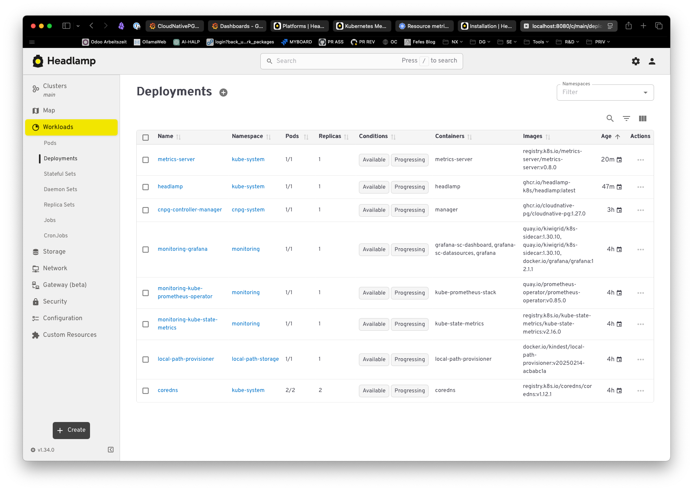

# Quickstart

```
# Install prerequisites
$ brew install kind lens helm

# Create empty cluster
$ kind create cluster --config clusters/local-kind/kind-config.yml --name experimental

# Or use mise task
mise run create_cluster

# Export Kubeconfig to clipboard (for importing into lens GUI)
kind get kubeconfig --name experimental | pbcopy
```

# GitOps with Flux

This repository is configured for GitOps using Flux.

## GitHub Token Setup

For Flux bootstrap to work, you need a GitHub fine-grained Personal Access Token with these permissions:

**Required Repository Permissions:**
- **Administration**: `Read and write` (needed to create deploy keys)
- **Contents**: `Read and write` (needed to read/write repository files)  
- **Metadata**: `Read-only` (needed to access repository metadata)

To create the token:
1. Go to GitHub Settings > Developer settings > Personal access tokens > Fine-grained tokens
2. Click "Generate new token"
3. Select your repository (`kind-k8s-experimental`)
4. Set the permissions above
5. Generate and save the token

## Bootstrap Flux

After creating the cluster, bootstrap Flux:

```
# Bootstrap Flux (if not already done)
flux bootstrap github \
  --owner=seletz \
  --repository=kind-k8s-experimental \
  --branch=develop \
  --path=clusters/local-kind \
  --personal

# Or use mise tasks
mise run flux_check
mise run flux_kustomisations

# Validate GitOps configuration locally
mise run validate
```

The infrastructure will be automatically deployed via Flux:
- **Monitoring**: kube-prometheus-stack via Helm
- **PostgreSQL**: CloudNativePG operator + cluster
- **Headlamp**: Kubernetes dashboard + metrics-server

Monitor deployment status:
```
# Watch Flux kustomizations
flux get kustomisations --watch

# Check specific components
kubectl get pods -n monitoring
kubectl get pods -n pg-example-cluster  
kubectl get pods -n kube-system | grep -E "(headlamp|metrics-server)"
```

# Monitoring


```
# Add the Prometheus community Helm repository
helm repo add prometheus-community https://prometheus-community.github.io/helm-charts
helm repo add grafana https://grafana.github.io/helm-charts
helm repo update

# Install the complete stack
helm install monitoring prometheus-community/kube-prometheus-stack \
  --namespace monitoring \
  --create-namespace \
  --set prometheus.service.type=NodePort \
  --set grafana.service.type=NodePort \
  --set alertmanager.service.type=NodePort
  ```

  In Lens, switch to "prometheus" as metrics source, then switch to "Prometheus Operator".

To access grafana, first get the grafana admin password:

```
kubectl --namespace monitoring get secrets monitoring-grafana -o jsonpath="{.data.admin-password}" | base64 -d ; echo
```

Then add a port forward:

```
export POD_NAME=$(kubectl --namespace monitoring get pod -l "app.kubernetes.io/name=grafana,app.kubernetes.io/instance=monitoring" -oname)
kubectl --namespace monitoring port-forward $POD_NAME 3000
```

Now you can access http://localhost:3000

The default installation adds many useful dashboards.

# PostgreSQL: CloudNativePG

Following the [docs](https://cloudnative-pg.io/documentation/1.27/installation_upgrade/)


```
# Install the Operator Manifest
kubectl apply --server-side -f \
  https://raw.githubusercontent.com/cloudnative-pg/cloudnative-pg/release-1.27/releases/cnpg-1.27.0.yaml

# Create and activate namespace for our new cluster
kubectl create namespace pg-example-cluster
kubectl config set-context $(kubectl config current-context) --namespace pg-example-cluster

# And provision a clister with 3 instances (1 master, 2 replicas)
kubectl apply -f pg-cluster-example.yml

# To enable scraping, label the podmonitor
kubectl label podmonitor pg-example-cluster release=monitoring

# Import the CloudNativePG Dashboard
kubectl apply -f cloudnative-pg-dashboard.yml
```

## CLI Management

Using the `krew` plugin `cnpg` we can manage PG clusters. (see [docs](https://cloudnative-pg.io/documentation/1.27/kubectl-plugin/#))

```
brew install kubectl-cnpg
```

(restart your shell)

Then you can do things like:

```
kubectl cnpg psql pg-example-cluster
psql (17.5 (Debian 17.5-1.pgdg110+1))
Type "help" for help.

postgres=#
```


# In-Cluster Management UI

Following the [docs](https://headlamp.dev/docs/latest/installation/in-cluster/)



```
# Apply the configuration
kubectl apply -f kubernetes-headlamp.yaml

# To have headlamp "see" cluster usage, we need to install metrics-server
# Downloaded from: https://github.com/kubernetes-sigs/metrics-server/releases/latest/download/components.yaml
# Modified for kind clusters by adding --kubelet-insecure-tls flag due to TLS certificate issues
#
# Diff applied to metrics-server Deployment spec.template.spec.containers[0].args:
#   - --cert-dir=/tmp
#   - --secure-port=10250
#   - --kubelet-preferred-address-types=InternalIP,ExternalIP,Hostname
#   - --kubelet-use-node-status-port
#   - --metric-resolution=15s
# + - --kubelet-insecure-tls
#
kubectl apply -f metrics-server-deployment.yaml
```

Use port-forward to access:

```
kubectl port-forward -n kube-system service/headlamp 8080:80
```

To access Headlamp, you'll need the service account token:

```
# Get the Headlamp access token
kubectl get secret headlamp-admin -n kube-system -o jsonpath='{.data.token}' | base64 -d ; echo
```

Copy this token and paste it into the Headlamp login screen when accessing the UI.

# Accessing All Services

Once everything is deployed, you can access all services via port-forwarding:

## Grafana Dashboard
```
kubectl port-forward -n monitoring service/monitoring-grafana 3000:80
```
Access: http://localhost:3000 (login: admin/[password from earlier])

## Prometheus
```
kubectl port-forward -n monitoring service/monitoring-kube-prometheus-prometheus 9090:9090
```
Access: http://localhost:9090

## Alertmanager
```
kubectl port-forward -n monitoring service/monitoring-kube-prometheus-alertmanager 9093:9093
```
Access: http://localhost:9093

## Headlamp (already covered above)
```
kubectl port-forward -n kube-system service/headlamp 8080:80
```
Access: http://localhost:8080

# Example Use Cases

## Importing existing off-cluster DB

See [bootstrap](https://cloudnative-pg.io/documentation/1.27/bootstrap/#) and [import databases](https://cloudnative-pg.io/documentation/1.27/database_import/).

To import a existing database into the cluster, we need to be able to connect **from K8S** to the source
database.  Once we have that, we can create a cluster *and specify a import job* which uses `pg_dump` to
dump the source and create the target database.

The `pg-cluster-hehe-example.yml` is a example, it assumes a running database at `192.168.200.30` with
credentials specified.

> [!Note]
> The example specifies the password of the source in cleartext.  In prod, use a `secret ref`.

```
# Create a new namespace and activate it
kubectl create nmespace hehe-dev
kubectl config set-context $(kubectl config current-context) --namespace hehe-dev

# Create a secret for the new database user
kubectl create secret generic hehe-dev-db-secret \
    --from-literal=username=careassist \
    --from-literal=password=secret

# Create the cluster and import the DB
kubectl apply -f pg-cluster-hehe-example.yml
```

The operator will create the primary, create a **import job**, imports teh DB an then continues creating
secondaries.

```
kubectl cnpg psql hehe-db-cluster hehe
psql (17.5 (Debian 17.5-1.pgdg110+1))
Type "help" for help.

hehe=# \dg
                                 List of roles
     Role name     |                         Attributes
-------------------+------------------------------------------------------------
 hehe              |
 postgres          | Superuser, Create role, Create DB, Replication, Bypass RLS
 streaming_replica | Replication

hehe=# select id,sync_id from careassist_subscriber limit 5;
 id |               sync_id
----+--------------------------------------
  9 | 775ed758-1a70-ef11-b52e-00155d750b01
 11 | e93c5559-bb66-ef11-b52e-00155d750b01
  8 | 714b1778-1970-ef11-b52e-00155d750b01
 15 | 88e98719-8410-f011-b52f-00155d750b01
  3 |
(5 rows)

hehe=#
```

Note that the target database's user and password are created according to the spec in the *initdb*
section with tis particular configuration.  The tables etc are re-owned to the newly created user.

To get the password, use:

```
kubectl get secret hehe-dev-db-secret -o jsonpath='{.data.password}' | base64 -d
```

> [!Note]
> The method is suitble for importing DBs of **source** PG versions lower or equal the **cluster** version.
> In this particular example, the source version was *16.10* and the tharget version is *17.5*.
