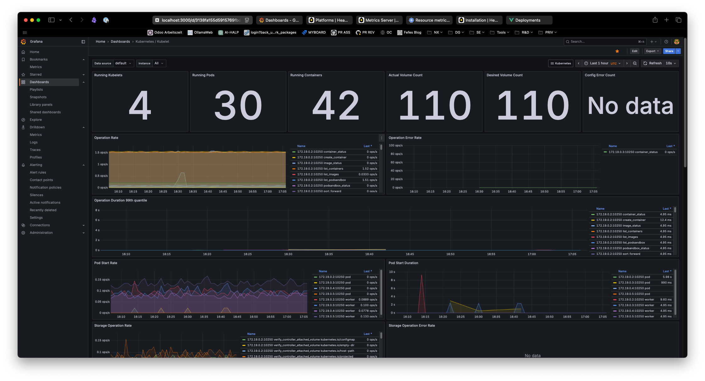
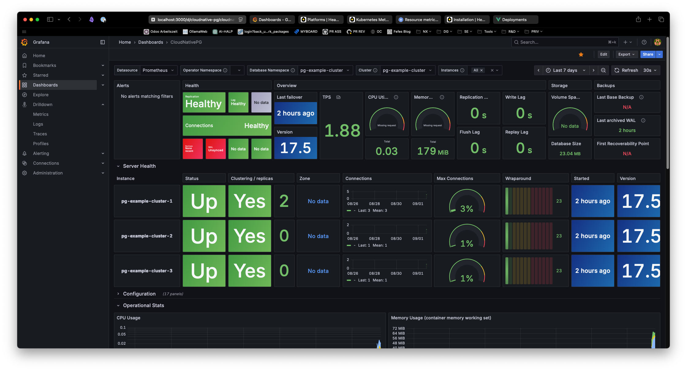

# Quickstart

```
# Install prerequisites
$ brew install kind lens helm

# Create empty cluster
$ kind create cluster --config kind-config.yml --name experimental

# Or use mise task
mise run create_cluster

# Export Kubeconfig to clipboard (for importing into lens GUI)
kind get kubeconfig --name experimental | pbcopy
```

# GitOps with Flux

This repository is configured for GitOps using Flux.

## GitHub Token Setup

For Flux bootstrap to work, you need a GitHub fine-grained Personal Access Token with these permissions:

**Required Repository Permissions:**
- **Administration**: `Read and write` (needed to create deploy keys)
- **Contents**: `Read and write` (needed to read/write repository files)
- **Metadata**: `Read-only` (needed to access repository metadata)

To create the token:
1. Go to GitHub Settings > Developer settings > Personal access tokens > Fine-grained tokens
2. Click "Generate new token"
3. Select your repository (`kind-k8s-experimental`)
4. Set the permissions above
5. Generate and save the token

## Bootstrap Flux

After creating the cluster, bootstrap Flux (one-time setup):

### Environment Setup

This repository uses 1Password for secure token management:

```bash
# Option 1: Use 1Password CLI (recommended)
mise run prepare_env  # Generates .env from .env.1p using 1Password secrets

# Option 2: Manual token setup
export GITHUB_TOKEN=<your-fine-grained-token>
```

The `.env.1p` file contains 1Password secret references (e.g., `GITHUB_TOKEN=op://vault/github-token/credential`) which are securely injected into `.env` without committing secrets to Git.

### Bootstrap Command

```bash
# Bootstrap Flux (replace with your GitHub username and repo name)
flux bootstrap github \
  --owner=<your-github-username> \
  --repository=<your-repo-name> \
  --branch=develop \
  --path=clusters/local-kind \
  --personal

# Check status and validate configuration
mise run flux_check
mise run flux_kustomisations
mise run validate
```

The infrastructure will be automatically deployed via Flux GitOps in two phases:

**Phase 1 (Controllers):**
- CloudNativePG operator (Helm chart)
- Helm repositories (prometheus-community, grafana, cnpg)

**Phase 2 (Configs - deployed after controllers are ready):**
- **Monitoring**: kube-prometheus-stack with PostgreSQL and Flux dashboards
- **PostgreSQL**: 3-instance cluster with monitoring integration
- **Management**: Headlamp dashboard + metrics-server (kind-optimized)

Monitor deployment status:
```
# Watch Flux kustomizations
flux get kustomisations --watch

# Check specific components
kubectl get pods -n monitoring
kubectl get pods -n pg-example-cluster
kubectl get pods -n kube-system | grep -E "(headlamp|metrics-server)"
```

# Monitoring Stack

## Dashboards Available



The GitOps setup includes pre-configured dashboards:
- **Kubernetes monitoring**: Standard cluster, node, and pod metrics
- **CloudNativePG**: PostgreSQL cluster monitoring and performance
- **Flux Control Plane**: GitOps pipeline monitoring and controller metrics

## PostgreSQL: CloudNativePG



The PostgreSQL cluster is automatically deployed via Flux GitOps:
- **Operator**: CloudNativePG deployed in `cnpg-system` namespace via Helm
- **Cluster**: 3-instance PostgreSQL cluster (1 primary + 2 replicas)
- **Monitoring**: Automatic metrics export with Grafana dashboard
- **Management**: kubectl cnpg plugin for cluster operations

# Cloud Native PG

Installed using flux.

## CLI Management

Using the `krew` plugin `cnpg` we can manage PG clusters. (see [docs](https://cloudnative-pg.io/documentation/1.27/kubectl-plugin/#))

```
brew install kubectl-cnpg
```

(restart your shell)

Then you can do things like:

```
kubectl cnpg psql pg-example-cluster
psql (17.5 (Debian 17.5-1.pgdg110+1))
Type "help" for help.

postgres=#
```

# Accessing Services

Once the GitOps deployment is complete, access all services via port-forwarding:

## Grafana (Monitoring Dashboards)
```bash
# Get admin password
kubectl get secret -n monitoring kube-prometheus-stack-grafana -o jsonpath="{.data.admin-password}" | base64 -d ; echo

# Port forward
kubectl port-forward -n monitoring service/kube-prometheus-stack-grafana 3000:80
```
**Access**: http://localhost:3000 (admin/[password from above])
**Dashboards**: Kubernetes metrics, CloudNativePG, Flux Control Plane

## Headlamp (Kubernetes Dashboard with Flux Plugin)
```bash
# Get access token
kubectl get secret headlamp-admin-token -n headlamp-system -o jsonpath='{.data.token}' | base64 -d ; echo

# Port forward
kubectl port-forward -n headlamp-system service/headlamp-system-headlamp 8080:80
```
**Access**: http://localhost:8080 (paste token from above)
**Features**: Cluster management, resource usage, metrics-server integration, **Flux GitOps management**

## Prometheus (Metrics Collection)
```bash
kubectl port-forward -n monitoring service/kube-prometheus-stack-prometheus 9090:9090
```
**Access**: http://localhost:9090

## Alertmanager (Alert Management)
```bash
kubectl port-forward -n monitoring service/kube-prometheus-stack-alertmanager 9093:9093
```
**Access**: http://localhost:9093

# Example Use Cases

## Importing existing off-cluster DB

See [bootstrap](https://cloudnative-pg.io/documentation/1.27/bootstrap/#) and [import databases](https://cloudnative-pg.io/documentation/1.27/database_import/).

To import a existing database into the cluster, we need to be able to connect **from K8S** to the source
database.  Once we have that, we can create a cluster *and specify a import job* which uses `pg_dump` to
dump the source and create the target database.

The `pg-cluster-hehe-example.yml` is a example, it assumes a running database at `192.168.200.30` with
credentials specified.

> [!Note]
> The example specifies the password of the source in cleartext.  In prod, use a `secret ref`.

```
# Create a new namespace and activate it
kubectl create nmespace hehe-dev
kubectl config set-context $(kubectl config current-context) --namespace hehe-dev

# Create a secret for the new database user
kubectl create secret generic hehe-dev-db-secret \
    --from-literal=username=careassist \
    --from-literal=password=secret

# Create the cluster and import the DB
kubectl apply -f pg-cluster-hehe-example.yml
```

The operator will create the primary, create a **import job**, imports teh DB an then continues creating
secondaries.

```
kubectl cnpg psql hehe-db-cluster hehe
psql (17.5 (Debian 17.5-1.pgdg110+1))
Type "help" for help.

hehe=# \dg
                                 List of roles
     Role name     |                         Attributes
-------------------+------------------------------------------------------------
 hehe              |
 postgres          | Superuser, Create role, Create DB, Replication, Bypass RLS
 streaming_replica | Replication

hehe=# select id,sync_id from careassist_subscriber limit 5;
 id |               sync_id
----+--------------------------------------
  9 | 775ed758-1a70-ef11-b52e-00155d750b01
 11 | e93c5559-bb66-ef11-b52e-00155d750b01
  8 | 714b1778-1970-ef11-b52e-00155d750b01
 15 | 88e98719-8410-f011-b52f-00155d750b01
  3 |
(5 rows)

hehe=#
```

Note that the target database's user and password are created according to the spec in the *initdb*
section with tis particular configuration.  The tables etc are re-owned to the newly created user.

To get the password, use:

```
kubectl get secret hehe-dev-db-secret -o jsonpath='{.data.password}' | base64 -d
```

> [!Note]
> The method is suitble for importing DBs of **source** PG versions lower or equal the **cluster** version.
> In this particular example, the source version was *16.10* and the tharget version is *17.5*.
